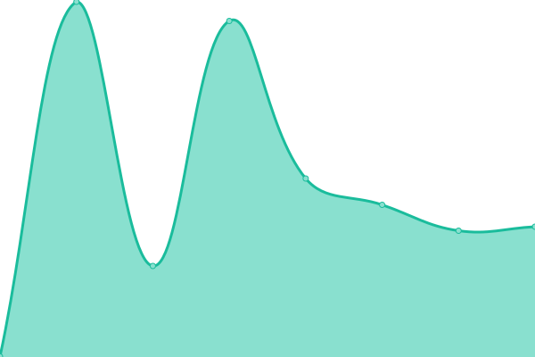
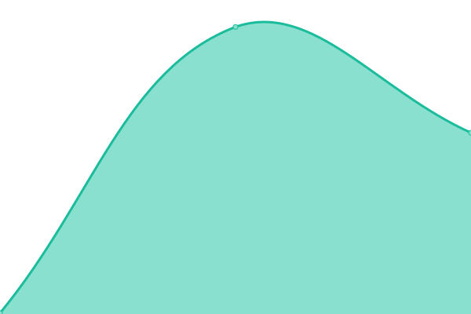
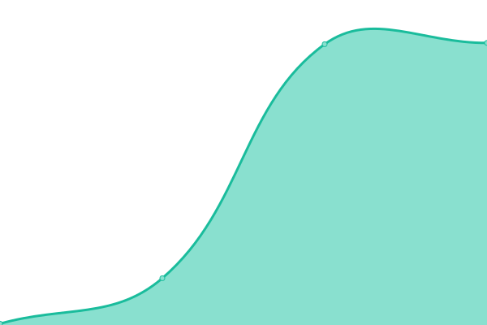

# [📈 Live Status](https://status.undeadservers.org): <!--live status--> **🟥 Complete outage**

This repository contains the open-source uptime monitor and status page for [Upptime](https://upptime.js.org), powered by [Upptime](https://github.com/upptime/upptime).

With [Upptime](https://upptime.js.org), you can get your own unlimited and free uptime monitor and status page, powered entirely by a GitHub repository. We use [Issues](https://github.com/upptime/upptime/issues) as incident reports, [Actions](https://github.com/reformscripts/undead-uptime/actions) as uptime monitors, and [Pages](https://status.undeadservers.org) for the status page.

<!--start: status pages-->
<!-- This summary is generated by Upptime (https://github.com/upptime/upptime) -->
<!-- Do not edit this manually, your changes will be overwritten -->
<!-- prettier-ignore -->
| URL | Status | History | Response Time | Uptime |
| --- | ------ | ------- | ------------- | ------ |
|  [Forums](https://undeadservers.org) | 🟥 Down | [forums.yml](https://github.com/reformscripts/undead-uptime/commits/HEAD/history/forums.yml) | 

 0ms
     
 | 

<a href="https://status.undeadservers.org/history/forums">0.00%</a>
    

|  [Donation Store](https://store.undeadservers.org) | 🟥 Down | [donation-store.yml](https://github.com/reformscripts/undead-uptime/commits/HEAD/history/donation-store.yml) | 

 0ms
     
 | 

<a href="https://status.undeadservers.org/history/donation-store">0.00%</a>
    

|  [Pterodactyl Panel](https://undead-panel.com) | 🟥 Down | [pterodactyl-panel.yml](https://github.com/reformscripts/undead-uptime/commits/HEAD/history/pterodactyl-panel.yml) | 

 0ms
     
 | 

<a href="https://status.undeadservers.org/history/pterodactyl-panel">0.00%</a>
    

|  [Pterodactyl sFTP](https://undead-panel.com) | 🟥 Down | [pterodactyl-s-ftp.yml](https://github.com/reformscripts/undead-uptime/commits/HEAD/history/pterodactyl-s-ftp.yml) | 

 0ms
     
 | 

<a href="https://status.undeadservers.org/history/pterodactyl-s-ftp">0.00%</a>
    

|  [Pterodactyl MySQL](https://undead-panel.com) | 🟥 Down | [pterodactyl-my-sql.yml](https://github.com/reformscripts/undead-uptime/commits/HEAD/history/pterodactyl-my-sql.yml) | 

 0ms
     
 | 

<a href="https://status.undeadservers.org/history/pterodactyl-my-sql">0.00%</a>
    

|  [Classic DarkRP](https://undead-panel.com) | 🟥 Down | [classic-dark-rp.yml](https://github.com/reformscripts/undead-uptime/commits/HEAD/history/classic-dark-rp.yml) | 

 0ms
     
 | 

<a href="https://status.undeadservers.org/history/classic-dark-rp">0.00%</a>
    

<!--end: status pages-->

[**Visit our status website →**](https://status.undeadservers.org)

## 📄 License

- Powered by: [Upptime](https://github.com/upptime/upptime)
- Code: [MIT](./LICENSE) © [Upptime](https://upptime.js.org)
- Data in the `./history` directory: [Open Database License](https://opendatacommons.org/licenses/odbl/1-0/)
